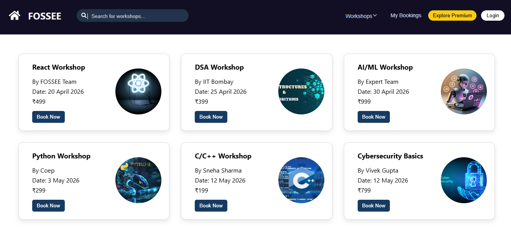
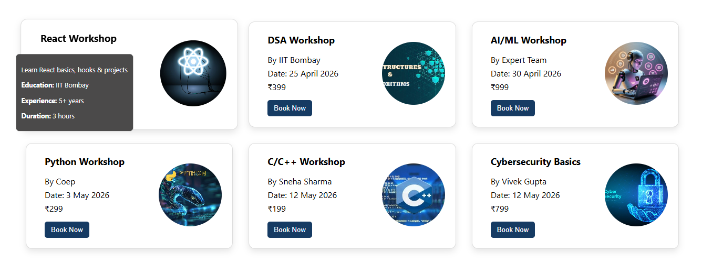
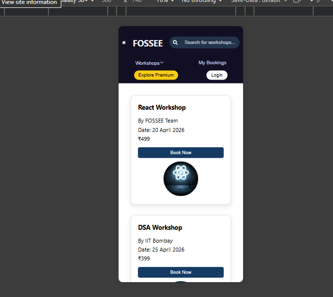
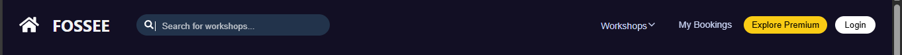

# Workshop Booking UI 
## Project Overview 

This project is a workshop booking UI built using React. 
It includes components like Navbar, Workshop Cards, and Footer.
The UI is designed to be clean, simple, and responsive. 

## Features
- Responsive Navbar
- Workshop Cards with details
- Clean UI design
- Responsive layout for mobile and desktop
   
### npm start
Runs the app in the development mode.\
Open [http://localhost:3000](http://localhost:3000) to view it in your browser.
The page will reload when you make changes.\
You may also see any lint errors in the console. 

## Reasoning
### 1. What design principles guided your improvements? 

While improving the UI, I focused on keeping the design simple and clean so easy to use.
I used proper spacing and alignment to make the layout look organized.
I also tried to keep consistency in components like navbar, cards, and buttons so everything looks uniform.

### 2. How did you ensure responsiveness across devices? 

To make the UI responsive, I used Flexbox and basic CSS techniques.
I also used media queries to adjust the layout for smaller screens like mobile devices. 
I tested the design using browser inspect tools and made changes wherever needed.

### 3. What trade-offs did you make between the design and performance?

I avoided heavy animations and large images to keep the application fast.
While more visual effects could improve appearance, I prioritized performance and smooth user experience. 

### 4. What was the most challenging part of the task and how did you approach it?

The most challenging part was making the layout responsive and properly aligned. 
Initially, some elements were not fitting well on smaller screens. I fixed this by adjusting the layout using Flexbox and testing multiple screen sizes until it worked properly. 
## Screenshots

### Main UI

### Hover Effect

### Mobile View

### Footer View

### Navbar View

